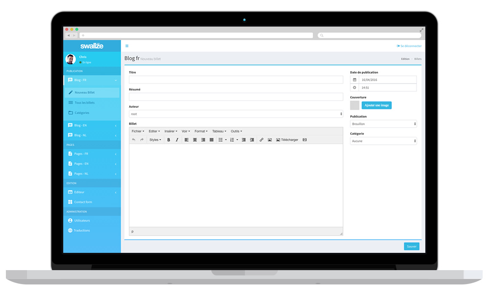

# [Swalize](http://swalize.com/) 1.3




## Note

Swalize n’est temporairement plus disponible au libre de téléchargement
 

## A Propos

Développé en PHP5, ce CMS est réalisé pour répondre à un besoin simple de rapidité et flexibilité. Il permet de créer un site vitrine d'entreprise multilingue rapidement. Plutôt que d'utiliser une Base de donnée relationnelle ou un nosql. Ce CMS dispose de son propre moteur de DB orienté Document JSON. 

Il permet également de créer une administration évolutive.

Swalize est également un CMS/Framework avec des fonctionnalités classiques mais il fonctionne de façon peu conventionnelle. Son admin se customise avec un tableau. Vous pouver créer votre site et ensuite vous définir des zones éditables.

Il est totalement indiqué pour des sites responsive Bootstrap, et se montre beaucoup plus efficace que Wordpress pour les sites onepage multilingues. 

Découvrez [le site du projet](http://swalize.com/1.0/). 

## Swalize-Framework est également une base que vous pouvez faire évoluer vous même.

*   Il permet de créer facilement des sites multilingues
*   Il supporte les plugins
*   Il pensé pour les sites onepage ou multipage dont la structure ne bouge pas.
*   Il dispose de fonction de publication d'article avec des champs customisables.
*   Il peut gérer un portfolio ou un catalogue de produit.
*   Il peut sauvegarder les mails envoyé depuis le formulaire de contact.
*   Il n'est pas optimisé pour les gros sites avec beaucoup de contenu.
*   Il fonctionne sans base de donnée.
*   Il peut être efficace comme admin simple pour paramètres à distance des apps iOS et Android car il génère des données au format Json.

Et évidemment, il sera régulièrement mis à jour sur Github.

## Mises à jour 

### Mise à jour  1.3

* Nouveau design plus moderne.
* Remplacement de la gestion de langues de l’admin.


### Mise à jour  1.2a

#### Réorganisation des dossiers DB et images

* Déplacement du fichier models.php à la racine 
* Déplacement des images dans /files/
* Déplacement de la DB dans /sw-db/

* Ajout du type "pages" dans les fonctions de blogging.  


### Mise à jour  1.1

#### Ajout du block de type separation pour models.php
```php
'sp_seo' => array(
'label' => ’Titre de cet espace’,
'type' => 'separation'
),
```

#### Ajout d’une valeur height pour les textarea de models.php
```php
'sub_baseline' => array(
'label' => ‘Mon texte’,
'type' => 'textarea',
'placeholder' => 'Un site cool pour tout le monde',
'height'=> 60
),
```

#### Ajout des fonctions :
```php
$sw->cmsInfos();  // pour afficher le temps de génération de la page en commentaire

$sw->hide_email($email);  // pour cacher une adresse email des moteurs de recherches.
```

#### Pour le plugin de contact form :  exemple d'un formulaire écrit directement en HTML.

#### Corrections diverses


## Comment débuter?

C'est très simple.

### Editez le fichier ./sw-admin/controls/models.php

-> modifiez secure_key , cette clé encrypte les DB. Si vous la modifiez, vous perdez vos données mais les blocks et articles resteront disponibles.

-> Définissez les langues,

-> Définissez votre structure de donnée.

### connectez vous sur ./sw-admin/

user: admin@swalize.com

pass: root

Créez un nouvel utilisateur admin et supprimez le compte Root.

Pensez à modifier « Site URL » dans l'éditeur.

## Le fichier models.php : Les options

Ce document est le couteau suisse du Framework. C'est dans ce document que vous pourrez structurer l'admin du site.

### Options ($swcnt_options)

_Ajouter ou enlevez une langue_
```php
    'languages' => array(
        'fr',
        'en'
    ) ,
```
_Définir de nouvelle langues_
```php
'languages_names' => array(

        'fr' => "Français",
        'en' => "English",
        'nl' => "Nederlands",
        'de' => "Deutsch"
    ) ,
```
_La Clé de sécurité doit être modifiée avant de commencer_

    'secure_key' => 'xxx765abc54',

_Passez sur False si le serveur ne supporte pas l'URL Rewriting_

    'urlrewriting' => true,

_Ce n'est pas obligatoire mais vous pouvez ajoutez votre adresse email_

    'contact_email' => '',

_Si activée, cette fonction peut poser des problèmes de compatibilité._

    'crypt' => 0,

_Ici, vous pouvez activer les fonctions de blogging mais également ajouter un catalogue de produit ou un portfolio. A l'usage, ces 3 outils se comportent de façon identiques mais vous pouvez les configurer individellement_

    'blog' => 1,
    'catalog' => 0,
    'portfolio' => 0

### Plugins ($swcnt_plugins)

_liste des plugins. Ajouter contact form peut être utile_

    'contact_form', 

## Le fichier models.php : La structure de données

L'admin du site se construit avec des « blocks » qui sont simplement des tableaux en PHP. Il est donc très facile d'ajouter un champ ou un éditeur wysiwyg dans l'administration du site. Le contenu du champ pourra être récupéré aisément sur le site.

### $swcnt_tree

Le tableau $swcnt_tree contient les pages de l'espace « Editeur ». Vous pouvez créer facilement l'administration d'une page d'accueil, du footer.

Ajouter ce tableau permet de créer la page Popol dans l'admin.
```php
    $swcnt_tree['popol'] = array(

        'sw_title' => 'Page de Popol',

        'sw_blocks' => array(

    	)
    );
```

Le « block » suivant est utilisé pour gérer la page d'infos du site. Chaque block est un champ dans la DB. 

Les différents types de champs sont :

* input_txt
* textarea
* htmlarea -> éditeur wysiwyg summernote
* blogarea -> éditeur wysiwyg tinymce
* select
* checkbox
* tags
* picture -> un bouton pour télécharger une photo.
* list -> permet de créer une sous-liste de champs en tableau. Pratique pour créer un album photos ou la navigation du site.


#### Exemple:

```php
$swcnt_tree['siteinfos'] = array(

    'sw_title' => 'site infos',

    'sw_blocks' => array(

        'title' => array(

            'label' => _('Site title'),

            'type' => 'input_txt',

            'placeholder' => 'Mon site'

        ),

        'baseline' => array(

            'label' => _('Site baseline'),

            'type' => 'input_txt',

            'placeholder' => 'Un site cool pour tout le monde'

        ),

        'site_url' => array(

            'label' => _('Site URL'),

            'type' => 'input_txt',

            'placeholder' => 'http://mysite.com'

        ),

        'navigation' => array(

            'label' => 'Navigation',

            'type' => 'list',

            'placeholder' => '',

            'submenu' => array(

                'name' => array(

                    'label' => _('Page name'),

                    'type' => 'input_txt',

                    'placeholder' => 'Mon page'

                ),

                'url' => array(

                    'label' => _('URL'),

                    'type' => 'input_txt',

                    'placeholder' => 'mapage'

                )

            )

        ),

        'twitter' => array(

            'label' => 'Profil twitter',

            'type' => 'input_txt',

            'placeholder' => 'http://twitter.com/swalize'

        ),

        'facebook' => array(

            'label' => 'Profil facebook',

            'type' => 'input_txt',

            'placeholder' => 'http://facebook.com/swalize'

        ),

    )

);

```

### $swcnt_blog, $swcnt_portfolio, $swcnt_catalog

Il s'agit de la structure des page d'articles, de produits ou de portfolio. Customisable avec les mêmes champs que le $swcnt_tree. Attention, certains champs sont utiles :« title,pubdate,category »

### $swcnt_form

Utiles pour stocker des formulaires utilisés par les plugins ou le site. Par exemple :


```php
$swcnt_form['contactform'] = array(

'firstname' => array(
    'label' => 'Firstname',
    'type' => 'input_txt',
    'required'  => 'Please enter your name.'
),

'lastname' => array(
    'label' => 'Lastname',
    'type' => 'input_txt',
    'required'  => 'Please enter your name.'
),

'email' => array(
    'label' => 'Email Adress',
    'type' => 'input_txt',
    'required'  => 'Please enter your email address.'
),
'message' => array(
    'label' => 'Message',
    'type' => 'textarea',
    'required'  => 'Please enter your message.'
)
);

```


## Développer son thème, les premiers pas avec $sw

Pour connecter Swalize Framework à un site, il suffit de l'inclure dans vos pages ou templates de cette façon.


```php
<?php
define('ADMIN_URL','sw-admin/');
include ADMIN_URL.'inc/system.php'; 
?>
```

la racine du site est disponible avec $site_url ou $sw_vars['site_url'];

#### le reste des données se récupère avec $sw

Langue en cours

```php 
$sw -> lang; 
```

récupérer dans un tableau les données qui sont sauvées avec le formulaire $swcnt_tree['page_de_test']

```php 
$sw -> block('page_de_test');
```

Générer une uri

```php 
$sw ->uri('page','arguments')
```

Traduire une phrase et l'importer dans l'admin de traduction

```php 
$sw -> _('phrase à traduire');
```

Obtenir le contenu d'un article dans un tableau. L'identifiant peut être le champ

```php 
$sw -> blogpost('identifiant de la page','blog' ou 'portfolio' ou 'catalog');
```

Lister les articles avec certains filtres

```php 
$sw -> blogposts('n° de page (1,2,3,…)','Nb maximum d'articles (100)','categorie ou 0','tag','blog' ou 'portfolio' ou 'catalog');
```

Lister les categories

```php 
$sw -> listCats('blog' ou 'portfolio' ou 'catalog');
```

Nom d'une catégorie à partir de son identifiant (slug)

```php 
$sw -> getCatName($catId,'blog' ou 'portfolio' ou 'catalog') ;
```

Supprimer les caractères spéciaux d'une chaine pour générer une url

```php 
$sw -> format_url('texte');
```

Exemple d'utilisation :

```php
<?php
define('ADMIN_URL', 'sw-admin/');
include ADMIN_URL.'inc/system.php';
/* Afficher les 100 derniers articles */
foreach ($sw -> blogposts(1, 100, 0,'','blog') as $k => $v)
    {
    echo '';
    echo '<h5>'.$v['title'].'</h5>
          <h6>'.$v['headline'].'</h6>
          <a href="'.SITE_URL.$sw->uri('article',$v['urltxt']).'">Lire la suite</a>';
    } 
?>
```


